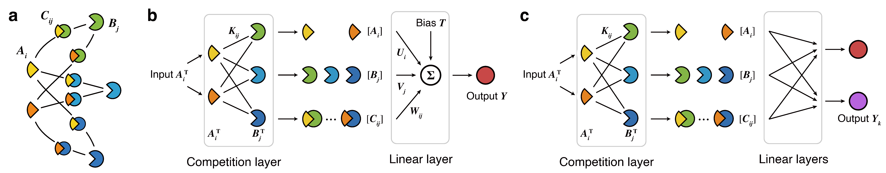
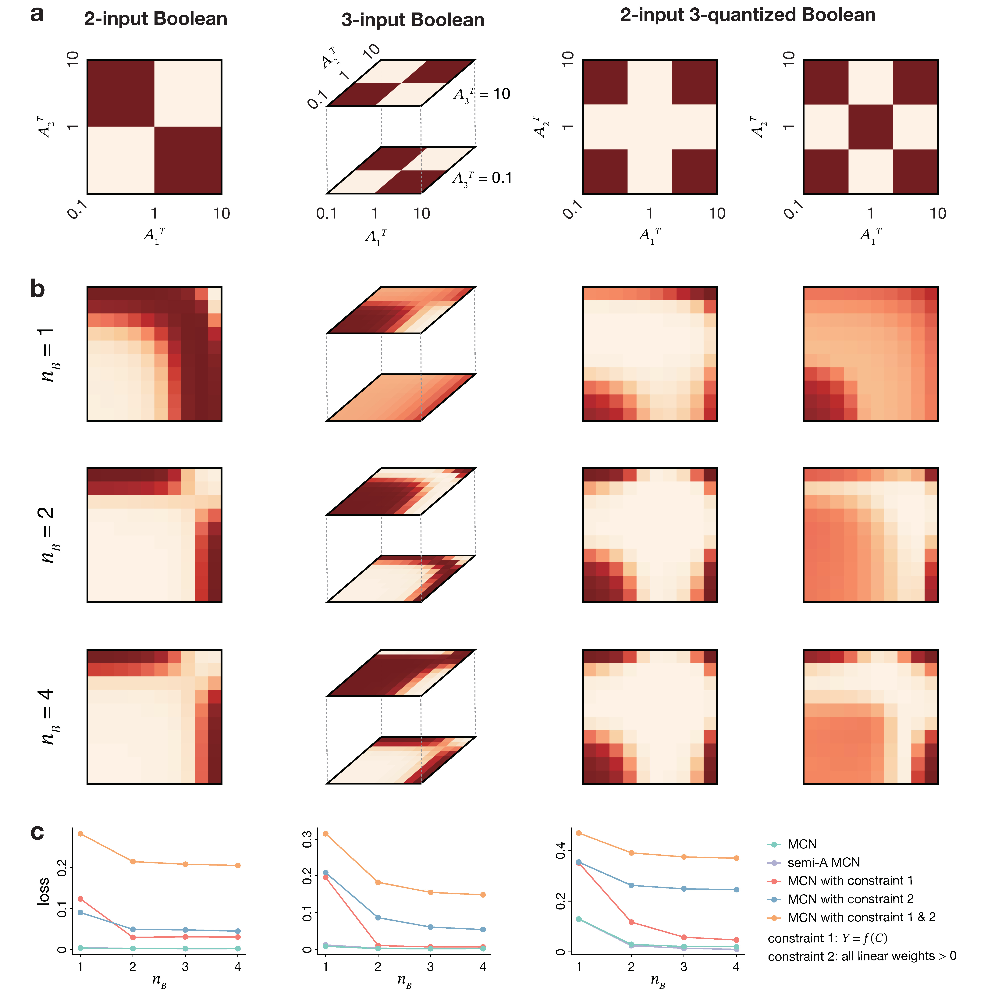

# Competitive_network

This is the code for the paper "Efficient computation by molecular competition networks".

## Introduction

Most biomolecular systems exhibit computation abilities, which are often achieved through complex networks such as signal transduction networks. Particularly, molecular competition in these networks can introduce crosstalk and serve as a hidden layer for cellular information processing. Despite the increasing evidence of competition contributing to efficient cellular computation, how this occurs and the extent of computational capacity it confers remain elusive. In this study, we introduced a mathematical model for Molecular Competition Networks (MCNs) and employed a machine learning-based optimization method to explore their computational capacity. Our findings revealed that MCNs, when compared to their non-competitive counterparts, demonstrate superior performance in both discrete decision-making and analog computation tasks. Furthermore, we examined how real biological constraints influence the computational capacity of MCNs, and highlighted the nonnegligible role of weak interactions. The study suggested the potential of MCNs as efficient computational structures in both *in vivo* and *in silico* scenarios, providing new insights into the understanding and application of cellular information processing.






## Install

You need to install Python 3.9, Pytorch 1.12.1, then

```
pip install -r requirements.txt
```

## Usage

1. Generate the data.

   ```
   python generate_data.py
   ```
2. Train the model.
   Modify configs/xxx.yaml content run the desired expriment with appropriate hyperparameters.

   ```
   python train.py -c configs/xxx.yaml
   ```

   After running, the results will be saved in `results_dir`.
3. Visualize the result.

   Change the `file_path` in plot_demo.py to the path generated in the previous step, then

   ```
   python plot_demo.py
   ```

## Citation

If you find this repo useful, please cite our paper:

```
@article{Cai2023Efficient,
  title={Efficient computation by molecular competition networks},
  author={Cai, Haoxiao and Wei, lei and Zhang, Xiaoran and Qiao, Rong and Wang, Xiaowo},
  journal={bioRxiv},
  year={2023},
  publisher={Cold Spring Harbor Laboratory}
}
```

## License

This project is licensed under the terms of the MIT license.
